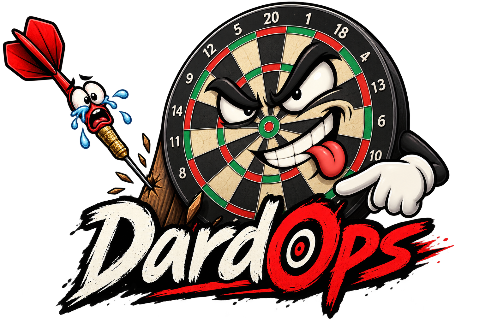

<div align="center">



# DardOps

**Una diana digital para dianas analógicas. Con marcador, voz y bastante mala leche.**<br>
**A digital brain for analogue dartboards. With scoring, speech and absolutely no moral support.**

[Español](#español) · [English](#english)

</div>

---

## Español

DardOps convierte una diana analógica —de esas que no tienen marcador, selector
de juegos ni piedad— en una experiencia parecida a la de una diana digital.
Indica los jugadores, elige juego y pulsa en pantalla la zona donde ha caído
cada dardo. DardOps hace las cuentas, cambia los turnos y juzga tus decisiones.

Al tercer lanzamiento anuncia la puntuación total del turno, el estado de la
partida y una pulla personalizada. Porque fallar un doble ya duele, pero siempre
puede doler un poco más.

### Qué hace

- Gestiona entre 1 y 8 jugadores con nombres personalizados.
- Incluye **501**, **301**, **Cricket**, **Vuelta al reloj** y
  **Puntuación alta**.
- Ofrece una diana SVG interactiva con simples, dobles, triples, bull y
  lanzamiento fuera (`0`).
- Calcula automáticamente puntos, busts, dobles de salida, cierres de Cricket,
  rondas, turnos y ganador.
- Muestra las marcas de Cricket con puntos verdes, naranjas y rojos.
- Permite deshacer los últimos 30 lanzamientos, por si el dedo también falla.
- Guarda la partida y las preferencias localmente en el navegador.
- Funciona en español e inglés, tanto en pantalla como por voz.
- Incluye temas claro y oscuro, interfaz responsive y feedback sonoro AudioCSS.
- Anuncia cada impacto, el cambio de jugador, el resumen del turno y el ganador,
  según el modo de voz elegido.
- Dispone de un repertorio generoso de pullas. La aplicación no te odia; solo
  dispone de datos.

### Modos de voz

El botón de voz recorre tres modos en el mismo control:

- `A`: voz completa —jugador, impacto, resumen, estado y pulla—.
- `T`: solo jugador, total del turno y pulla.
- `0`: silencio total. Ideal para perder sin testigos electrónicos.

El botón de sonido controla por separado el feedback AudioCSS. El selector
`ES`/`EN` cambia inmediatamente la interfaz, los estados, las pullas y el idioma
de la voz.

### Arranque con Docker

Requisitos: Docker con Docker Compose. El lanzador comprueba automáticamente
que el cliente, Compose v2 y el motor estén disponibles; si falta algo, muestra
instrucciones bilingües específicas para macOS o para la distribución Linux
detectada.

```sh
./start.sh
```

En Windows 10/11, usa el lanzador nativo desde CMD o PowerShell:

```bat
start.cmd
```

Si Docker Desktop no está instalado, `start.cmd` ofrece instrucciones bilingües
para preparar WSL 2 e instalarlo mediante `winget` o desde la documentación
oficial.

Después abre [http://localhost:3847](http://localhost:3847).

El contenedor publica el puerto poco habitual `3847`, sirve internamente en
`8087` y tiene un endpoint de salud en `/health`. Se ejecuta como usuario no
privilegiado, sin capacidades Linux, con `no-new-privileges` y con el sistema de
archivos de solo lectura. La diana podrá insultarte, pero no podrá convertirse
en root.

Comandos equivalentes:

```sh
docker compose build
docker compose up -d
docker compose ps
```

### Desarrollo

Requisitos: Node.js 22 y npm.

```sh
npm ci
npm run dev
```

El servidor de desarrollo queda disponible en
[http://localhost:4387](http://localhost:4387).

Para validar los cambios:

```sh
npm test
npm run build
```

### Tecnologías y librerías

| Pieza | Uso |
|---|---|
| HTML5, CSS3 y JavaScript | Aplicación ligera sin framework de interfaz |
| SVG | Diana interactiva y escalable |
| [Vite](https://vite.dev/) 7 | Servidor de desarrollo y build de producción |
| [Vitest](https://vitest.dev/) 3 | Pruebas unitarias del motor y la interfaz generada |
| `acs-audio` 0.9.6 | Feedback sonoro declarativo mediante AudioCSS |
| Web Speech API | Locución en español e inglés con las voces del navegador |
| `localStorage` | Persistencia local de partida y preferencias |
| Node.js 22 Alpine | Etapa reproducible de compilación |
| NGINX Unprivileged 1.29 Alpine | Servidor estático no-root con cabeceras de seguridad |
| Docker Compose | Arranque y configuración endurecida del contenedor |

### Privacidad y funcionamiento local

DardOps no necesita cuentas, backend ni base de datos. Somos buena gente: no
hay telemetría, analítica, rastreadores ni llamadas a servidores externos. No
enviamos nombres, puntuaciones, preferencias ni ninguna otra cosa a ninguna
parte, y no usamos una partida de dardos como excusa para andar jodiendo tu
privacidad.

La partida y las preferencias viven exclusivamente en `localStorage`. La
aplicación no carga tipografías, audio ni scripts remotos, y NGINX aplica una
política CSP cerrada. Si borras los datos del navegador, también borrarás la
partida. Luego no digas que fue un bust.

---

## English

DardOps turns an analogue dartboard —the kind with no scoreboard, game selector
or mercy— into something closer to a digital board. Enter the players, choose a
game and click the on-screen segment hit by each dart. DardOps handles the maths,
changes turns and quietly documents your decline.

After the third dart it announces the turn total, the current game status and a
personalised insult. Missing a double already hurts, but software can always
make it more educational.

### What it does

- Manages 1 to 8 players with custom names.
- Includes **501**, **301**, **Cricket**, **Around the clock** and
  **High score**.
- Provides an interactive SVG board with singles, doubles, triples, bull and
  misses (`0`).
- Automatically handles scores, busts, double-out rules, Cricket closures,
  rounds, turns and winners.
- Displays Cricket marks as green, orange and red dots.
- Lets you undo the latest 30 darts, because fingers miss too.
- Stores the game and preferences locally in the browser.
- Works in Spanish and English, both on screen and through speech.
- Includes light and dark themes, a responsive interface and AudioCSS feedback.
- Announces each hit, player changes, turn summaries and the winner according
  to the selected voice mode.
- Comes with a healthy collection of insults. The app does not hate you; it
  merely has evidence.

### Voice modes

The voice button cycles through three modes:

- `A`: full voice —player, hit, summary, status and insult—.
- `T`: player, turn total and insult only.
- `0`: complete silence. Perfect for losing without electronic witnesses.

The sound button controls AudioCSS feedback separately. The `ES`/`EN` selector
immediately switches the interface, game statuses, insults and spoken language.

### Run with Docker

Requirements: Docker with Docker Compose. The launcher automatically checks the
client, Compose v2 and the engine; when something is missing, it prints specific
instructions for macOS or the detected Linux distribution.

```sh
./start.sh
```

On Windows 10/11, use the native launcher from CMD or PowerShell:

```bat
start.cmd
```

If Docker Desktop is missing, `start.cmd` provides bilingual instructions to
prepare WSL 2 and install it with `winget` or through Docker's official
documentation.

Then open [http://localhost:3847](http://localhost:3847).

The container publishes the deliberately uncommon port `3847`, serves the app
internally on `8087` and exposes `/health`. It runs as an unprivileged user with
all Linux capabilities dropped, `no-new-privileges` enabled and a read-only
filesystem. The board can insult you, but it cannot become root.

Equivalent commands:

```sh
docker compose build
docker compose up -d
docker compose ps
```

### Development

Requirements: Node.js 22 and npm.

```sh
npm ci
npm run dev
```

The development server is available at
[http://localhost:4387](http://localhost:4387).

Validate changes with:

```sh
npm test
npm run build
```

### Technologies and libraries

| Component | Purpose |
|---|---|
| HTML5, CSS3 and JavaScript | Lightweight application with no UI framework |
| SVG | Interactive, scalable dartboard |
| [Vite](https://vite.dev/) 7 | Development server and production build |
| [Vitest](https://vitest.dev/) 3 | Unit tests for the game engine and generated UI |
| `acs-audio` 0.9.6 | Declarative sound feedback through AudioCSS |
| Web Speech API | Spanish and English speech using browser voices |
| `localStorage` | Local persistence for the game and preferences |
| Node.js 22 Alpine | Reproducible build stage |
| NGINX Unprivileged 1.29 Alpine | Non-root static server with security headers |
| Docker Compose | Hardened container startup and configuration |

### Privacy and local operation

DardOps needs no accounts, backend or database. We are the good guys: there is
no telemetry, analytics, tracking or contact with external servers. We do not
send names, scores, preferences or anything else anywhere, and we do not use a
darts match as an excuse to screw with your privacy.

The game and preferences live exclusively in `localStorage`. The application
loads no remote fonts, audio or scripts, and NGINX applies a restrictive CSP.
Clearing browser data also clears the game. Please do not call that a bust.
